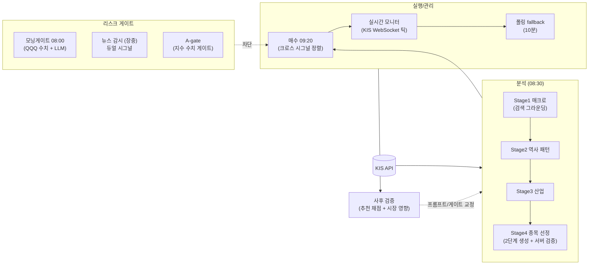

# Trading System

한국투자증권(KIS) OpenAPI + Gemini 기반 **AI 자동매매 시스템**.
AI 4단계 파이프라인이 매크로 → 역사적 패턴 → 산업 → 종목 순으로 좁혀 추천하고, 스케줄러가 매수·모니터링·청산·사후 검증까지 자동화한다. 실계좌로 운용 중.

- **Backend**: Python / FastAPI / PostgreSQL / APScheduler
- **AI**: Gemini (모델 체인 fallback, 검색 그라운딩)
- **실시간**: KIS WebSocket (가격 틱 + 체결통보)
- **Frontend**: Next.js + TypeScript + Tailwind
- **알림**: Telegram Bot

---

## 아키텍처



핵심 루프는 **분석 → 실행 → 사후 검증 → 교정**이다. 추천은 전부 자동 채점되고(`verifier.py`), 그 데이터가 프롬프트와 게이트를 고치는 근거가 된다.

---

## 설계에서 중요하게 다룬 것들

### 1. LLM 출력을 신뢰하지 않는 구조

- **AI 확률 폐기**: 검증 515건에서 AI가 산출한 성공 확률과 실제 승률의 상관이 없음을 확인(60~70% 구간 실승률 22.9%)하고, 수치 확률 산출을 제거했다. LLM은 종목 큐레이션만 하고 순위는 서술 순서로만 받는다.
- **환각 3겹 방어** (`runner.py`, `analyzer.py`): 사전필터로 후보 압축 → 그룹 분할 → "자유형식 분석(고품질 모델) → 코드 추출(경량 모델)" 2단계 생성 → 서버가 실시세 price_map에 없는 종목코드는 저장 거부.
- **산수는 앱이 한다**: 수급 페이스 판정, 상대수익률, PER(TTM) 같은 파생지표는 전부 앱이 계산해 프롬프트에 주입하고 재계산을 금지한다 (`watchlist/analyzer.py:_pace_judgment` 등).
- **반증 가능한 분석**: 관심종목 분석의 무효화_조건은 `{조건, check_type, params}` 구조로 강제하고, 매 거래일 앱이 **결정론적으로 자동 판정**해 충족 시 텔레그램으로 알린다 (`watchlist/invalidation.py`). 판정에 LLM은 관여하지 않는다.

### 2. 실패를 숨기지 않는 fail-safe

- 지수 조회 실패는 `0.0`이 아니라 `None`을 반환하고, 호출부가 "확인 불가"로 보고 안전 방향(매수 전체 스킵)으로 처리한다 (`client.py:get_index_change_pct`).
- 뉴스 감시 실패가 NORMAL(정상)로 저장돼 감시 공백을 은폐하던 버그를 교정 — 실패는 `check_failed` 마커로 분리하고 3연속 실패 시 어드민 알림 (`news/watcher.py`).
- 외부 어댑터(DART/네이버)는 예외 대신 `{"available": False, "note": 사유}`를 반환하고 결측은 `data_flags`에 기록 — 분석은 계속되고, 없는 데이터를 있는 것처럼 위장하지 않는다.
- 수급 60/120일 누적은 커버리지 미달이면 부분합 대신 `None` + 보유 일수를 명시한다 (`flow_store.py`).

### 3. KIS 연동 디테일

- **토큰 3단 캐시**: 인메모리 → 파일(`~/.kis_token_cache.json`, 재시작 생존) → 신규 발급. 전역 락 + double-check로 동시 발급 방지, 만료 5분 여유 (`client.py:_ensure_token`).
- **사전 스로틀**: 초당 18회(한도 20, 여유 2) sliding window rate limiter를 모든 호출 진입점에 자동 적용 — 429를 사후 처리하는 게 아니라 도달하지 않게 한다 (`client.py:_RateLimiter`).
- **실시간은 WebSocket, 폴링은 안전망**: 보유 종목은 서버가 상시 구독해 틱 단위로 손절/익절 즉시 판정 (`realtime_monitor.py`). 자체 하트비트 + 백오프 재연결 + 재구독. 10분 폴링은 만료 처리와 WS 끊김 구간 fallback.

### 4. 모의투자는 KIS VTS 대신 자체 시뮬레이터

실전 시세·호가를 그대로 쓰되 체결만 시뮬레이션하는 가상계좌를 직접 구현했다 (`virtual_broker.py`). 매수=매도호가1, 매도=매수호가1로 스프레드 비용을 보수적으로 반영하고 수수료·거래세를 차감한다. 실계좌와 가상계좌는 통계가 격리되고(`/positions/stats?scope=`), Circuit Breaker 같은 자본 보호 레이어는 실계좌에만 적용된다.

### 5. 데이터 성격에 따라 저장 방식을 가른다

- 분석 시점 입력 스냅샷·AI 결과처럼 **쓰기 후 불변인 문서**는 JSONB — 사후 재구성이 목적이고 스키마가 계속 진화하므로.
- 기간 집계를 반복하는 **수급 시계열은 정규화 테이블**(`investor_flow_daily`) — KIS가 최근 30거래일만 주기 때문에 매일 적재해 60/120일 히스토리를 직접 만든다.
- 증권사 API 키는 `.env`가 아니라 DB에 Fernet 암호화로 저장 — 키는 `SECRET_KEY`에서 파생하므로 DB가 유출돼도 앱 서버 없이는 복호화 불가 (`core/security.py`).

### 6. 사후 검증이 시스템을 고친다

- 모든 추천은 hold 기간 경과 후 일봉 기준으로 자동 채점된다 — 같은 날 목표가/손절가 동시 터치는 손절 우선(보수적 관례) (`verifier.py`).
- 실사례: 프롬프트에 역발상 기준이 섞여 들어가 강세장 승률이 무너진 것을 검증 데이터 528건 분석으로 발견하고 모멘텀 기준으로 복원. 이후 LLM 서술에 의존하지 않는 **지수 수치 게이트**(전일 -2.5% / 3일 누적 -4% 시 선정 스킵)를 병행 도입했다.
- 뉴스 이벤트·모닝게이트 판정도 다음날 실제 지수 변화율을 기록해 정확도를 사후 추적한다.

---

## 주요 기능

- **AI 4단계 추천 파이프라인** — 매크로(검색 그라운딩) → 역사 패턴 → 산업 → 종목 선정, 전략별 종목 풀/선정 모드(momentum / earnings_catalyst) 분기
- **자동매매** — 크로스 시그널 정렬 매수, 트레일링 스탑, time-based stop, thesis 재검증(보유 논거 무효 시 조기 청산)
- **리스크 게이트 다중화** — 모닝게이트(QQQ 수치+LLM), 장중 뉴스 듀얼 시그널(AI 판정 × 실시간 지수 교차 검증), Circuit Breaker(연속 손실 시 유저 매수 차단)
- **관심종목 분석 일지** (중장기 수동매매) — 분석 시점 스냅샷 영구 보존, PER 4종 병기, 무효화 조건 자동 감시
- **백테스트** — 라이브와 동일한 사전필터/청산 모델, 동일 풀 랜덤 픽 베이스라인과 비교
- **멀티유저** — JWT + RBAC, 유저별 전략 구독, 텔레그램 개별 알림

## 자동화 스케줄 (KST)

| 시각 | 잡 |
|---|---|
| 08:00 | 모닝게이트 — 야간 리스크 체크, 이상 시 당일 매수 차단 |
| 08:30 (월/수/금) | AI 분석 파이프라인 |
| 09:20 | 자동 매수 (게이트 통과 시) |
| 장중 | 실시간 WS 모니터(상시) + 10분 폴링 + 뉴스 감시 + thesis 재검증(10:00/14:00) |
| 16:00~16:20 | 뉴스/추천 시장 영향 검증 → 수급 적재 → 무효화 조건 자동 판정 |
| 00:10 | 추천 결과 채점 |

## Quick Start

```bash
python3.11 -m venv .venv && source .venv/bin/activate
pip install -r requirements.txt
cp .env.example .env   # DATABASE_URL, SECRET_KEY, GEMINI_API_KEY 등
alembic upgrade head
uvicorn app.main:app --host 0.0.0.0 --port 8000
cd frontend && npm install && npm run dev
```

KIS API 키 등록(DB 암호화 저장), 초기 seeding, systemd 상시 실행 등 전체 절차는 **[docs/setup.md](docs/setup.md)** 참조.

## 스코프와 한계

개인 운용 규모의 시스템이라 의도적으로 단순하게 둔 부분이 있다.

- 스케줄러는 Celery가 아닌 APScheduler — 워커 1개, 잡 12개 규모에 분산 큐는 과함. 대신 잡별 실패 알림 + 재시작 catch-up으로 보완
- 오래된 데이터 정리/파티셔닝 정책 없음 — 현재 용량에서 불필요, 필요 시 수급 테이블 월 파티셔닝부터
- 지정가 주문·ATR 포지션 사이징 미구현 (시장가 + 고정 금액)
- 백테스트는 매크로 단계를 재현하지 못함(검색 그라운딩이 현재 시점이라 lookahead 방지 목적) — 기술 기준만 평가됨을 명시
